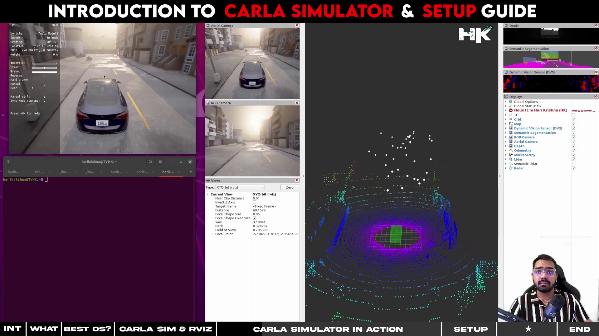

# Introduction to Carla Simulator & Setup Guide

  

---------------------------------------------

## What is Carla Simulator
The CARLA simulator is an open-source platform designed to support the development, training, and validation of autonomous driving systems. It provides a highly realistic and flexible simulation environment with customizable scenarios, built on Unreal Engine and OpenDRIVE. CARLA includes a range of features such as a sensor suite, traffic manager, and the ability to distribute workloads across multiple GPUs for enhanced performance. It's widely used for generating synthetic training data not only for autonomous vehicles but also for other robotics applications, simulating real-world urban and highway environments

---------------------------------------------

## Installation Prerequisites
1) A compatible operating system: You will need an Ubuntu version that supports the specific version of CARLA you wish to install. For instance, CARLA `0.9.13` is compatible with `ROS-bridge` as well as `ROS-Noetic`, which operates on `Ubuntu 20.04`.

2) Operating System and GPU: Ensure that your operating system meets the necessary specifications to run CARLA, including a compatible `GPU` that the CARLA simulator can utilize. ***Set up and update the required graphics drivers accordingly***. In my case, if you enter the command `nvidia-smi`, it will display my NVIDIA drivers.

3) Clean and Fresh OS: This installation guide is designed to assist with a from-scratch installation, which means starting with a clean slate,         
 `(1 and 2 Completed)`, then installing ROS, required libraries, and finally the CARLA simulator. It is advisable to begin with no pre-installed packages to avoid conflicts with the installation steps outlined in this guide. If any packages are present, it's recommended to clear them before proceeding.

---------------------------------------------

---------------------------------------------

---------------------------------------------

## Installation Phases
The installation process for the CARLA simulator is divided into two phases.
  #### PHASE 1: Install all necessary libraries and `ROS` related commands.
  #### PHASE 2: Dedicated to the installation of `Carla Simulator`.
  #### PHASE 3: Addressing any `errors` that may occur after installation.

---------------------------------------------

## Original Map Generated without Map Refinment:

  

---------------------------------------------

## Map after Refinment using Erosion and Dilation

### • Erosion
  Erosion is a morphological process that shrinks the boundaries of the foreground object, effectively reducing noise and small details from an image.

### • Dilation 
  Dilation is the complementary process that expands the boundaries of the foreground object, often used to fill in small holes and connect disjointed elements in an image.

  
  
  
  

---------------------------------------------

## My Project Video Demonstration:

  
  

---------------------------------------------
